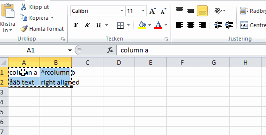
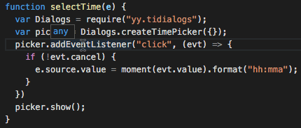
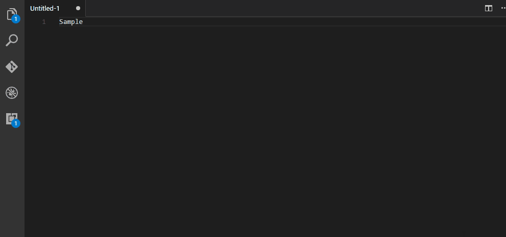
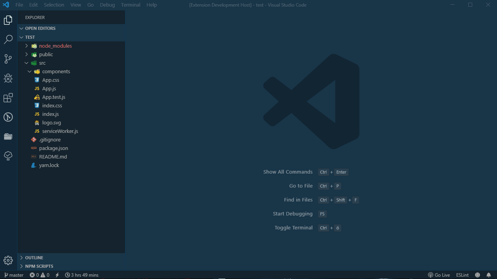

Below is a list of extensions that I find useful and want to make others aware of. I have excluded many language specific extensions such as html preview, or pylance, as these you would come across working in those areas regardless. I have also excluded theme specific extensions as these are always personal choice.

## Core
#### Dendron
**id:** [dendron.dendron](https://marketplace.visualstudio.com/items?itemName=dendron.dendron)

Core hierarchical note taking app and features, including preview, publishing, refactoring and more.

#### Project Manager
**id:** [alefragnani.project-manager](https://marketplace.visualstudio.com/items?itemName=alefragnani.project-manager)

Easily switch between folders and workspace (and git repos) in VScode windows without having to navigate to the folder each time.

#### Live Share
**id:** [ms-vsliveshare.vsliveshare](https://marketplace.visualstudio.com/items?itemName=ms-vsliveshare.vsliveshare)

Share your window and terminal and files (optionally) with other people in VScode for true collaborative coding and debugging.

## Visual
#### CodeSnap 
**id:** [adpyke.codesnap](https://marketplace.visualstudio.com/items?itemName=adpyke.codesnap)

Take nice snapshots of your code, theme and all, to paste into chat or elsewhere. Does not retain text.

#### Color Highlight
**id:** [naumovs.color-highlight](https://marketplace.visualstudio.com/items?itemName=naumovs.color-highlight)
Highlights colour codes in your editor to see what colours they are without having to render the code/page.

#### Peacock
**id:** [johnpapa.vscode-peacock](https://marketplace.visualstudio.com/items?itemName=johnpapa.vscode-peacock)

Change the colour of each workspace/folder you open and work with to help identify what you are working on at a given time.

## Utility
#### Batch Rename
**Id**: [jannisx11.batch-rename-extension](https://marketplace.visualstudio.com/items?itemName=jannisx11.batch-rename-extension)

Allows you to rename files on bulk in the explorer, useful for when you need to prefix/affix something to a name.

#### Bookmarks
**id:** [alefragnani.bookmarks](https://marketplace.visualstudio.com/items?itemName=alefragnani.bookmarks)

Mark lines in code and jump to them at any point, useful when you want to make references but folding or comments don't quite work right for you.

#### Excel to Markdown Table
**id:** [csholmq.excel-to-markdown-table](https://marketplace.visualstudio.com/items?itemName=csholmq.excel-to-markdown-table)

Copy excel tables and paste them into markdown.

#### Quick and Simple Text Selection
**id:** [dbankier.vscode-quick-select](https://marketplace.visualstudio.com/items?itemName=[dbankier.vscode-quick-select)

<kbd>Ctrl</kbd>+<kbd>k</kbd>+<kbd>(</kbd>

Highlight text between two capture symbols (brackets, quotes, etc) with a single keyboard shortcut. 

#### vscode-input-sequence
**id:** [tomoki1207.vscode-input-sequence](https://marketplace.visualstudio.com/items?itemName=tomoki1207.vscode-input-sequence)

<kbd>Ctrl</kbd>+<kbd>alt</kbd>+<kbd>0</kbd>

Use multi-cursor to create sequences of arbitrary length and style, very handy when you need to number outputs! You can change the start, operation, step, displayed digits, and even the number base. 

#### Folder Templates
**id:** [huuums.vscode-fast-folder-structure](https://marketplace.visualstudio.com/items?itemName=huuums.vscode-fast-folder-structure)

Create new folders with specific sub-folder structure and files, very useful if each of your projects always has the same structure.

